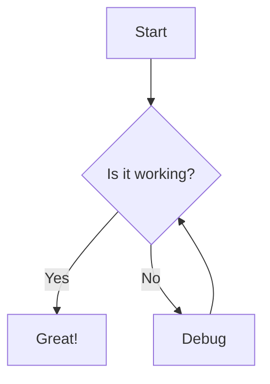

# Mermaid.js Flowchart Wizard

A modern, responsive web application that allows users to create, preview, and export flowcharts using Mermaid.js syntax.

## 🚀 Features

- **Real-time Preview**: See your flowchart come to life as you type
- **3-Step Wizard Interface**: Simple and intuitive user experience
- **Export Options**: Download your diagrams as PNG or SVG
- **Responsive Design**: Works seamlessly on all devices
- **Modern UI**: Built with Tailwind CSS for a beautiful interface

## 🛠️ Technology Stack

- **Frontend**: HTML, JavaScript, Tailwind CSS
- **Diagram Engine**: [Mermaid.js](https://mermaid-js.github.io/)
- **Export Tools**: Native SVG export and DOM-to-image conversion for PNG

## 📋 Prerequisites

- Modern web browser (Chrome, Firefox, Safari, Edge)
- No additional installation required - runs entirely in the browser

## 🚀 Getting Started

1. Clone the repository:
   ```bash
   git clone https://github.com/yourusername/mermaid-wizard.git
   ```

2. Open `index.html` in your web browser

3. Start creating your flowcharts!

## 💡 How to Use

### Step 1: Input
- Enter your Mermaid.js syntax in the editor
- Use the provided examples as a reference
- Click "Next" to preview your diagram

### Step 2: Preview
- Review your flowchart in real-time
- Make adjustments if needed
- Click "Next" to proceed to export

### Step 3: Export
- Choose your preferred format (PNG or SVG)
- Download your diagram
- Share your creation with others

## 📝 Example Mermaid Syntax



## 🔧 Development

### Project Structure
```
mermaid-wizard/
├── index.html
├── /assets
│   ├── styles.css
│   └── logo.svg
├── /js
│   ├── app.js
│   ├── mermaid-preview.js
│   └── export-utils.js
└── /lib
    └── mermaid.min.js
```

### Local Development
1. Clone the repository
2. Open `index.html` in your browser
3. Make changes to the source files
4. Refresh to see your changes

## 🤝 Contributing

Contributions are welcome! Please feel free to submit a Pull Request.

1. Fork the repository
2. Create your feature branch (`git checkout -b feature/AmazingFeature`)
3. Commit your changes (`git commit -m 'Add some AmazingFeature'`)
4. Push to the branch (`git push origin feature/AmazingFeature`)
5. Open a Pull Request

## 📄 License

This project is licensed under the MIT License - see the [LICENSE](LICENSE) file for details.

## 🙏 Acknowledgments

- [Mermaid.js](https://mermaid-js.github.io/) for the powerful diagramming library
- [Tailwind CSS](https://tailwindcss.com/) for the utility-first CSS framework
- All contributors who have helped shape this project

## 📞 Support

If you encounter any issues or have questions, please:
1. Check the [documentation](https://mermaid-js.github.io/)
2. Open an issue in the GitHub repository
3. Contact the maintainers

---

Made with ❤️ by [Your Name] 